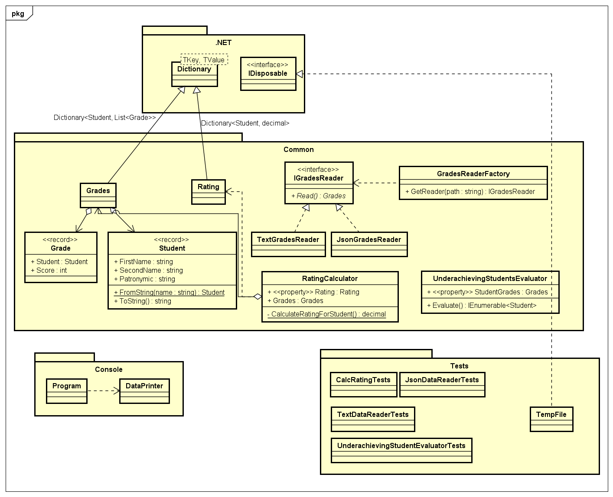

# Лабораторная 1 по дисциплине "Технологии программирования"

## Тема: Знакомство с системой контроля версий Git и инструментом CI/CD Travis CI

Вариант 4

Формат входного файла: JSON

Индивидуальное задание: 

> Рассчитать и вывести на экран количество студентов,
> имеющих академические задолженности (имеющих балл
> < 61 хотя бы по одному предмету)

### Используемые средства:

Язык: C# 9

Рантайм: .NET 5

Библиотеки для консольного приложения
* CommandLineParser - парсер аргументов командной строки
* Spectre.Console - pretty-printing в консоль

Библиотеки для тестирования:
* NUnit - базовая библиотека юнит-тестов
* FluentAssertions - библиотека для "красивых" ассертов

CI/CD - GitHub Actions:
* GH Action `actions/checkout@v2` - выполняет `git checkout` на текущую ревизию, чтобы CI/CD имел доступ к состоянию репозитория.
* GH Action `actions/setup-dotnet@v1` - устанавливает dotnet нужной версии 

## UML Диаграмма классов

## Пример использования

## Применания

* TravisCI не поддерживает CI/CD для .NET 5 приложений, поэтому было принято решение использовать в качестве инструмента для CI/CD - Github Actions.

## Выводы

В рамках лабораторной работы я изучил основы работы с такими инструментами как Git, Github Actions и успешно их применил для выполнения индивитуального задания.
